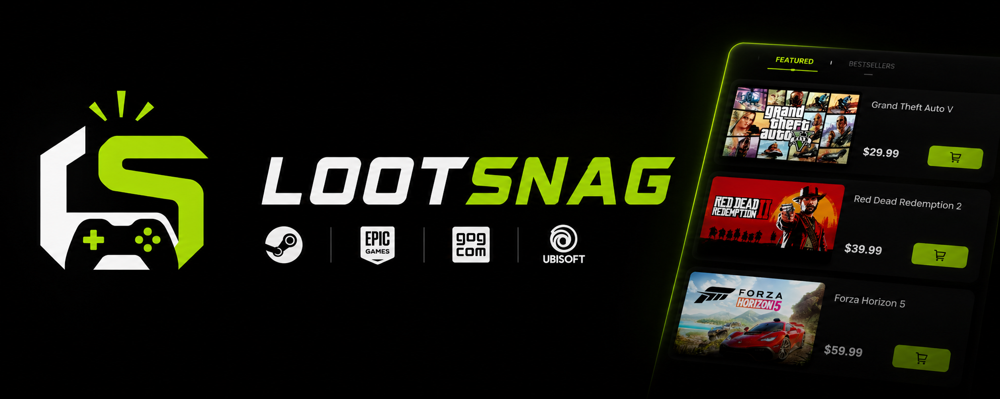

<div align="center">
  <h1>
  
  LootSnag
</h1>

  <p>Discord bot that tracks free games and deals so you don't have to.</p>

  [](https://discord.com/oauth2/authorize?client_id=1508171200289968178&permissions=8&integration_type=0&scope=bot+applications.commands)

  
  
  
  
</div>

---

LootSnag watches Epic, Steam, and a bunch of other PC game stores and posts alerts in your Discord server when games go free or hit big discounts. It uses Discord's Components V2 (the new card-style embeds), shows prices in INR or USD, and lets users track specific games on their wishlist.

Everything it pulls from is a free/public API — no paid subscriptions needed. RAWG is the one optional exception (fallback images), and the bot works perfectly fine without it.

---

## What it does

- Posts alerts when games go free (Epic weekly drops, Steam free weekends)
- Sends deal alerts when games hit your configured discount threshold (default 80%+)
- Per-user wishlist — add games you want, get a DM or channel ping when they go on sale
- `/search` to look up current prices across all stores for any game
- INR and USD support with live exchange rates (Frankfurter API)
- Per-server channel config — separate channels for free games, deals, wishlist alerts, and logs
- Deduplicates posts so it won't spam the same deal twice
- Edits existing posts when deal info updates instead of reposting

---

## Stores covered

| Store | Free game alerts | Deal alerts |
|---|---|---|
| Steam | free weekends | ✅ |
| Epic Games | weekly free claims | ✅ |
| GOG | — | ✅ |
| Humble Bundle | — | ✅ |
| Fanatical | — | ✅ |
| Ubisoft | — | ✅ |
| itch.io | — | ✅ |

---

## Commands

| Command | What it does |
|---|---|
| `/search <game>` | Look up prices across all stores |
| `/freegames` | Show what's free right now |
| `/deals [threshold]` | Show deals above a discount % |
| `/wishlist add <game>` | Track a game for price alerts |
| `/wishlist remove <game>` | Remove a game from tracking |
| `/wishlist list` | See everything you're tracking |
| `/currency` | Switch between INR and USD |
| `/settings view` | See your current settings |
| `/settings threshold` | Set the minimum deal % for this server |
| `/settings alertmethod` | Choose how wishlist alerts reach you |
| `/channels set` | Point alert types to specific channels |
| `/channels view` | See the current channel setup |
| `/stores` | List all supported stores |
| `/ping` | Check latency |
| `/stats` | Bot stats (deals sent, searches, uptime) |

**Owner only** (your Discord user ID set in `OWNER_ID`):

| Command | What it does |
|---|---|
| `/owner reload` | Re-register slash commands without restarting |
| `/owner logs <channel>` | Set the log channel |
| `/owner cache clear` | Wipe cached API data |
| `/owner cache stats` | See how many entries are cached |
| `/owner cron <job>` | Trigger a cron job manually to test it |
| `/owner config` | View current bot config values |

---

## Folder layout

```
LootSnag/
├── index.js                    # Entry point
├── deploy-commands.js          # Manual deploy script (now redundant)
├── package.json
├── schema.sql
├── .env.example
├── assets/
│   └── logo.png
└── src/
    ├── commands/               # 10 slash commands
    │   ├── channels.js         # /channels set|view
    │   ├── currency.js         # /currency
    │   ├── deals.js            # /deals
    │   ├── freegames.js        # /freegames
    │   ├── owner.js            # /owner (owner-only)
    │   ├── ping.js             # /ping
    │   ├── search.js           # /search
    │   ├── settings.js         # /settings view|threshold|alertmethod
    │   ├── stats.js            # /stats
    │   ├── stores.js           # /stores
    │   └── wishlist.js         # /wishlist add|remove|list
    ├── config/
    │   ├── colors.js
    │   ├── constants.js        # CRON_SCHEDULES, CACHE_TTL, LIMITS, DEFAULT
    │   └── emojis.js
    ├── cron/
    │   ├── cleanup.js          # Daily cleanup at 3am
    │   ├── deals.js            # Every 4h
    │   ├── freeGames.js        # Every 2h
    │   └── wishlist.js         # Every 6h
    ├── database/
    │   ├── connection.js       # MariaDB pool
    │   └── models/
    │       ├── deals.js
    │       ├── guild.js
    │       ├── messages.js
    │       ├── user.js
    │       └── wishlist.js
    ├── embeds/
    │   ├── dealEmbed.js
    │   ├── freeGameEmbed.js
    │   ├── searchEmbed.js
    │   └── wishlistEmbed.js
    ├── events/
    │   ├── guildCreate.js
    │   ├── interactionCreate.js
    │   └── ready.js
    ├── handlers/
    │   ├── commandHandler.js
    │   ├── cronHandler.js
    │   └── eventHandler.js
    ├── routes/
    │   └── index.js
    ├── services/
    │   ├── cheapshark.js
    │   ├── epic.js
    │   ├── exchangeRate.js
    │   ├── imageService.js
    │   └── steam.js
    └── utils/
        ├── cache.js
```

---

## License
[MIT](./LICENSE)
